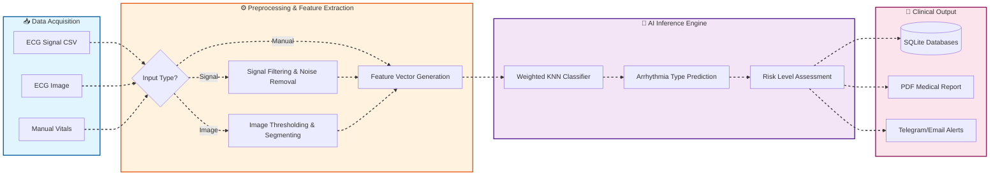
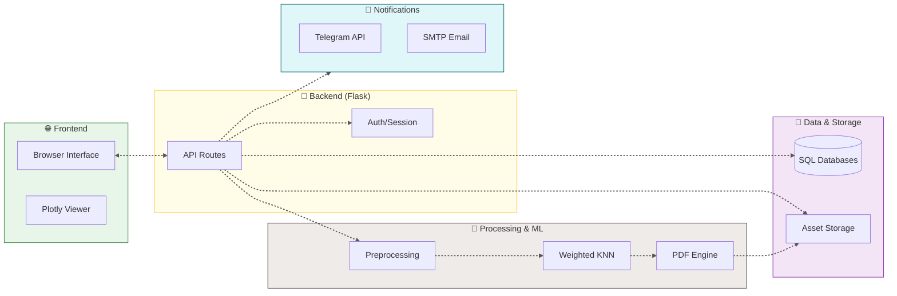

  

<h1 align="center">Detection & Classification of Cardiac Arrhythmia</h1>

  <strong>An AI-powered diagnostic tool for real-time ECG analysis and clinical reporting</strong>

  
  
  
  

---

## 📝 Project Overview

This repository implements a state-of-the-art **ECG Arrhythmia Detection and Classification** system. Designed for clinicians and medical researchers, it bridges the gap between raw signal data and actionable medical insights using advanced Machine Learning.

### 🌟 Key Features

| Feature | Description |
| :--- | :--- |
| **🔍 Multi-Source Input** | Support for ECG CSVs, high-res images, and manual physiological data. |
| **🧠 Weighted KNN Intelligence** | Classifies 13+ arrhythmia types with high precision using a pre-trained Weighted KNN model. |
| **📊 Signal Visualization** | Interactive Plotly dashboards for wave analysis (P, QRS, T waves). |
| **📄 Clinical Reports** | Automated PDF generation with patient data and risk assessment. |
| **👨‍⚕️ Doctor Portal** | Dedicated dashboard for patient management and appointment scheduling. |
| **🔔 Instant Alerts** | Integrated Telegram and Email notifications for high-risk cardiac events. |

---

## 🏥 Clinical Workflow

1. **Patient Intake**: Register patient data and record vital signs.
2. **ECG Analysis**: Upload raw ECG data (image/CSV) or enter manual readings.
3. **Model Inference**: AI extracts features and predicts the arrhythmia category.
4. **Review & Report**: Doctor reviews the findings and generates a clinical PDF.
5. **Follow-up**: System triggers alerts to relevant medical staff if necessary.

---

## 🎨 Methodology & System Architecture

### 📊 Methodology Flowchart

### 🏗️ System Architecture

---

## 🛠️ Technology Stack

- **Backend**: Flask (Python 3.8+)
- **Database**: SQLite3 (Distributed `hospital.db` and `user_data.db`)
- **Machine Learning**: Scikit-Learn (Weighted KNN), NumPy, SciPy, Pandas
- **Image Analysis**: OpenCV, Matplotlib
- **Frontend**: HTML5, CSS3, JavaScript (Plotly.js for signals)
- **Reporting**: ReportLab (Professional PDF Engine)
- **Communication**: SMTP (Email), Telegram Bot API

---

## 📂 Project Structure

- `app.py`: Main Flask application containing all routes and logic.
- `NOTEBOOK_FILES/`: Contains the pre-trained `model.pkl`.
- `datasets/ecg_images/`: Directory for ECG image data.
- `static/`: Assets including CSS, images, and generated reports.
- `templates/`: Jinja2 templates for the clinical web interface.
- `requirements.txt`: Python dependencies.

---

## 🚀 Future Roadmap

- **☁️ Cloud Integration**: Sync patient reports with Azure/AWS Health.
- **📱 Mobile App**: Flutter-based companion for real-time patient monitoring.
- **⏱️ Real-time IoT**: Support for live ECG streaming from wearable sensors.
- **🤖 LLM Summaries**: Automated clinical notes generation using Gemini/GPT-4.

---

**Developed with ❤️ by Jaideep**  
*Empowering Healthcare with Intelligent Machine Learning*
